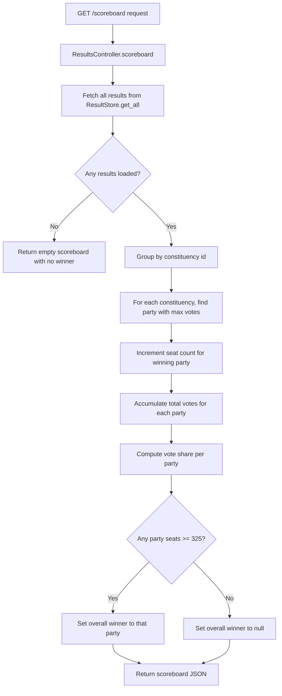
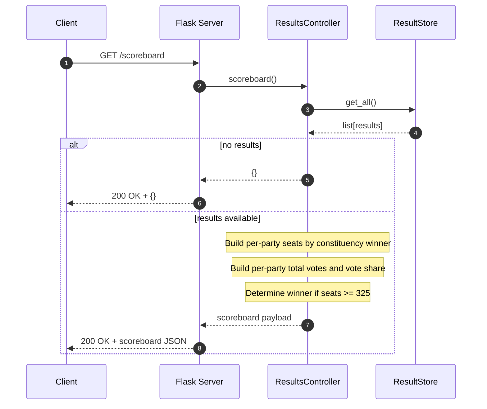

# Election API Scoreboard Specs

## Requirement Summary

The API must expose `GET /scoreboard` to report the election state using first-past-the-post logic.

Expected scoreboard output:
- Seats won per party.
- Overall winner when a party reaches at least 325 seats.
- Bonus: total votes per party.
- Bonus: total vote share per party.

Domain rules:
- Each constituency contributes one seat.
- Constituency winner is the party with the highest vote count in that constituency.
- A party is the overall winner when seats >= 325.

## Implementation Logic (Scoreboard)

The current codebase has a scoreboard placeholder in `ResultsController.scoreboard()`.

Recommended implementation behavior:
1. Read all stored result entries from `ResultStore.get_all()`.
2. Aggregate results by constituency id.
3. For each constituency, select the party with the max `votes` and award one seat.
4. Aggregate total votes for each party across all results.
5. Compute vote share for each party from global total votes.
6. Derive overall winner when any party reaches 325 seats.
7. Return a JSON object with `seats`, `winner`, and (bonus) `votes` and `share` sections.

## Flow Diagram

## Sequence Diagram

